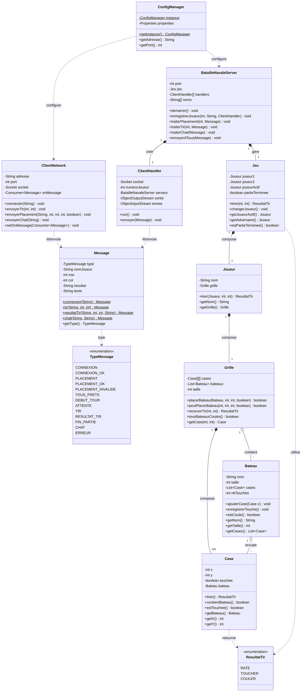
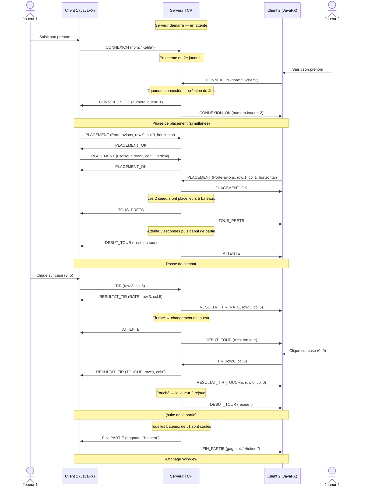

#  Bataille Navale — Java / JavaFX

> Jeu de Bataille Navale en réseau, développé dans le cadre de la Licence Pro DevOps à l'Université Claude Bernard Lyon 1 (2025-2026).

**Groupe :** Kalifa Rouis & Hichem Meneceur  
**Technologies :** Java 17+, JavaFX 21, Maven, TCP/IP

---

##  Sommaire

- [Présentation](#-présentation)
- [Fonctionnalités](#-fonctionnalités)
- [Lancer l'application](#-lancer-lapplication)
- [Architecture](#-architecture)
- [Diagramme de classes](#-diagramme-de-classes)
- [Diagramme de séquence](#-diagramme-de-séquence)
- [Structure du projet](#-structure-du-projet)
- [Notions appliquées](#-notions-appliquées)

---

##  Présentation

La Bataille Navale est un jeu de stratégie en réseau opposant **2 joueurs** depuis deux machines distinctes. Le projet repose sur une architecture **client-serveur TCP** :

- Le **serveur** tourne en ligne de commande et orchestre la partie
- Le **client** est une application de bureau avec interface **JavaFX**

---

##  Fonctionnalités

-  Connexion au serveur avec saisie du prénom
-  Placement interactif de 5 bateaux sur une grille 10x10 (horizontal / vertical)
-  Combat en temps réel avec alternance des tours
-  Détection automatique des tirs (raté, touché, coulé)
-  Chat en temps réel intégré à l'écran de jeu
-  Écran de victoire avec option rejouer
-  Système de reconnexion automatique (10 tentatives)

---

##  Lancer l'application

### Prérequis

- Java 17 ou supérieur
- Maven 3.x
- JavaFX 21

### Configuration

Le fichier `src/main/resources/config.properties` contient les paramètres réseau :

```properties
serveur.adresse=localhost
serveur.port=5000
serveur.nb.joueurs=2
```

### Étapes de lancement

**1. Compiler le projet**
```bash
mvn clean install
```

**2. Lancer le serveur** (dans un terminal séparé)
```bash
mvn exec:java -Dexec.mainClass="com.devops.bataillenavale.network.BatailleNavaleServer"
```
> Le serveur affiche dans la console : `[Serveur] En attente de 2 joueurs...`

**3. Lancer le client — Joueur 1** (dans un nouveau terminal)
```bash
clic droit sur Launcher et run
```

**4. Lancer le client — Joueur 2** (dans un autre terminal)
```bash
clic droit sur Launcher et run
```

>  Le serveur doit être lancé **avant** les clients. Les deux fenêtres client peuvent être lancées sur la même machine ou sur deux machines différentes (modifier `serveur.adresse` dans `config.properties`).

---

##  Architecture

L'application suit une architecture **client-serveur TCP** avec le pattern **MVC** côté client.

```
┌─────────────────────────────────────────────────────┐
│                  CLIENT (JavaFX)                    │
│                                                     │
│  ┌──────────┐  ┌────────────┐  ┌────────────────┐  │
│  │  models  │  │ controller │  │     view       │  │
│  └──────────┘  └────────────┘  └────────────────┘  │
│                ┌────────────┐                       │
│                │  network   │                       │
│                │ ClientNet  │                       │
│                └─────┬──────┘                       │
└──────────────────────┼──────────────────────────────┘
                       │  TCP — Sockets Java
┌──────────────────────┼──────────────────────────────┐
│              SERVEUR │(ligne de commande)            │
│                      │                              │
│  ┌───────────────────┴──────────────────────────┐   │
│  │         BatailleNavaleServer                 │   │
│  │  ┌─────────────────┐  ┌──────────────────┐   │   │
│  │  │ ClientHandler 1 │  │ ClientHandler 2  │   │   │
│  │  │ Thread-Joueur-1 │  │ Thread-Joueur-2  │   │   │
│  │  └─────────────────┘  └──────────────────┘   │   │
│  └──────────────────────────────────────────────┘   │
└─────────────────────────────────────────────────────┘
```

---

##  Diagramme de classes



---

##  Diagramme de séquence



---

##  Structure du projet

```
BatailleNavale/
├── src/
│   └── main/
│       ├── java/
│       │   └── com/devops/bataillenavale/
│       │       ├── controller/
│       │       │   ├── GameController.java       # Gestion des tirs
│       │       │   └── PlacementController.java  # Gestion du placement
│       │       ├── models/
│       │       │   ├── Bateau.java               # Navire
│       │       │   ├── Case.java                 # Cellule de la grille
│       │       │   ├── Grille.java               # Plateau 10x10
│       │       │   ├── Jeu.java                  # Chef d'orchestre
│       │       │   ├── Joueur.java               # Joueur
│       │       │   └── ResultatTir.java          # Enum RATE/TOUCHER/COULER
│       │       ├── network/
│       │       │   ├── BatailleNavaleServer.java # Serveur TCP
│       │       │   ├── ClientHandler.java        # Thread par joueur (serveur)
│       │       │   ├── ClientNetwork.java        # Couche réseau (client)
│       │       │   ├── ConfigManager.java        # Singleton config
│       │       │   ├── Message.java              # Objet sérialisable réseau
│       │       │   └── TypeMessage.java          # Enum des types de messages
│       │       └── view/
│       │           ├── ChatView.java             # Fenêtre de chat
│       │           ├── GameView.java             # Écran de jeu principal
│       │           ├── HelloApplication.java     # Point d'entrée JavaFX
│       │           ├── MenuView.java             # Écran de connexion
│       │           ├── PlacementView.java        # Placement des bateaux
│       │           ├── TransitionView.java       # Écran passage de tour
│       │           └── WinView.java              # Écran de victoire
│       └── resources/
│           └── config.properties                 # Configuration réseau
├── .gitignore
├── pom.xml                                       # Configuration Maven
└── README.md
```

---

##  Notions appliquées

| Notion | Application dans le projet |
|--------|---------------------------|
| **POO — Encapsulation** | Attributs `private` + getters dans toutes les classes |
| **POO — Composition** | `Jeu` → `Joueur` → `Grille` → `Case` / `Bateau` |
| **POO — Agrégation** | `Case` référence un `Bateau` (nullable) |
| **Enum** | `ResultatTir`, `TypeMessage` |
| **Collections** | `List<Bateau>`, `List<Case>` avec `ArrayList` |
| **Streams & Lambdas** | `bateaux.stream().allMatch(Bateau::estCoule)` |
| **Multithreading** | `Runnable`, `Thread`, `synchronized`, `volatile` |
| **Pattern Singleton** | `ConfigManager` avec double-checked locking |
| **Pattern Producteur/Consommateur** | `ChatView` avec `BlockingQueue` |
| **Réseau TCP** | `ServerSocket`, `Socket`, `ObjectOutputStream` |
| **Sérialisation** | `Message implements Serializable` |
| **Fichier Properties** | `config.properties` lu par `ConfigManager` |
| **Maven** | Gestion des dépendances JavaFX, build |
| **Git** | Gestion de versions, collaboration |

---

##  Auteurs

| Nom | GitHub |
|-----|--------|
| Kalifa Rouis | [@RouisKalifa](https://github.com/RouisKalifa) |
| Hichem Meneceur | https://github.com/Hiishaa |

---

*Licence Pro DevOps — Université Claude Bernard Lyon 1 — 2025-2026*
